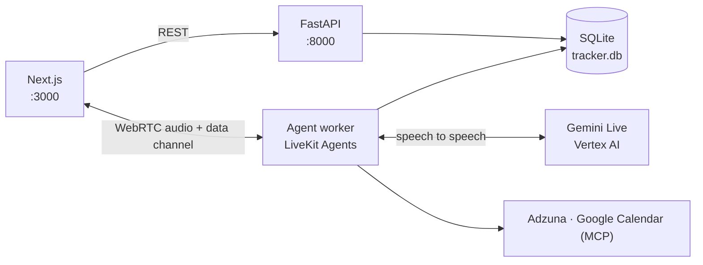

# Job Search Command Center

A voice-first console for running a job search. You talk to it; it fetches jobs,
scores them against your résumé, tracks applications through stages, schedules
interviews on your calendar, and runs mock interviews.

The screen is a live view of the same state the assistant is mutating — not a
separate app you drive by hand. Every action the agent takes is a real database
write the interface reflects immediately, so speaking and clicking are
interchangeable rather than parallel systems that drift apart.

---

## What it does

| | |
|---|---|
| **Discover** | Pulls listings from Adzuna using a query derived from your résumé, then scores each one with Gemini: a 0–100 match, the skills you hit, and the gaps. |
| **Apply** | Tracks applications through `saved → applied → screening → round 1/2 → final → offer / rejected`, by voice or from the card. |
| **Track** | The whole board grouped by stage, so you can see where every company stands. |
| **Schedule** | Books interviews and reminders on Google Calendar through an MCP server. |
| **Practice** | Generates interview questions from the job description *and* your résumé, conducts the interview, and saves a transcript with feedback. |

## Architecture



Three processes, one database. The API and the agent both write to SQLite
directly — there is no RPC between them, which is why an action taken by voice
appears on the dashboard on the next refresh.

The browser and the agent share a **LiveKit room**. Audio flows over WebRTC;
structured events flow over the room's data channel in both directions. The
agent publishes `navigate`, `jobs.updated`, `application.moved`; the UI
publishes `ui.command` for the Practice and Exit buttons. That gives buttons a
path that never depends on the model choosing to act.

## How the agent works

One agent, `CoPilot`, with two modes rather than two personas. Mode is ordinary
local state:

```python
self._interview: Interview | None    # its presence IS the mode
```

Entering a mock interview swaps the instructions, narrows the exposed tools to
the interview's own two, and clears the conversation so the interviewer is
isolated from earlier chat.

Three decisions carry most of the reliability:

**Grounding.** Before every user turn the current feed is injected with database
ids, so *"move the Whirlpool one to round two"* resolves without a lookup round
trip. Capped at 20 jobs, and skipped during an interview so isolation holds.

**Ids the model cannot invent.** Every write tool verifies the id it was given
and names the row it touched. Previously the model read a result count as an id
and reported changes it had never made.

**Fuzzy lookup.** Job search ranks rather than filters, so a speech-to-text slip
like `Senas` still resolves to `Sanas` instead of silently returning nothing.

## Getting started

**Prerequisites** — Python 3.12+, Node 20+, [`uv`](https://docs.astral.sh/uv/)
(only if you want the calendar tools), and accounts for LiveKit Cloud, Google
Cloud with Vertex AI enabled, and Adzuna.

```bash
# backend
cd backend
python -m venv .venv
.venv/Scripts/pip install -e ".[dev]"     # macOS/Linux: .venv/bin/pip
cp .env.example .env                      # then fill it in

# frontend
cd ../frontend
npm install
```

Start all three processes:

```powershell
.\scripts\dev.ps1
```

Then open **http://localhost:3000**. The script stops any previous instances
first and tees each process to `backend/uvicorn.log`, `backend/worker.log`, and
`frontend/next.log`.

Without PowerShell, run them in three terminals:

```bash
cd backend && .venv/bin/python -m uvicorn api.main:app --port 8000
cd backend && .venv/bin/python -m agent.worker dev
cd frontend && npm run dev
```

> Backend code has no hot reload — the agent SDK removed in-process auto-reload,
> and uvicorn's reloader is unreliable in this venv. Change backend code, restart.

## Layout

```
backend/
  agent/      personas.py (the agent + its tools), worker.py (session setup),
              grounding.py, calendar.py, diagnostics.py, latency.py
  core/       domain logic: jobs, scoring, tracker, search, mock, interviews
  api/        FastAPI app
  tests/      213 tests
frontend/
  app/        (shell) dashboard + pipeline, (focus) full-bleed practice route
  components/ voice rail, job cards, transcript, mic control, chat input
  lib/        API client, event codec, agent-state mapping
docs/         project documentation
scripts/      dev.ps1
```

## Tests

```bash
cd backend && .venv/Scripts/python -m pytest      # 213 tests
cd frontend && npx tsc --noEmit && npx eslint . && npm run build
```

## Notes

**Latency.** The agent uses Gemini Live speech-to-speech, so there is no
separate STT/TTS hop. The dominant cost is region: Live models are not offered
in `asia-south1`, so a worker in India pays ~285 ms to `us-central1` against
~60 ms locally. Running the worker in `us-central1` is the fix.

**Rooms.** Each page load mints a fresh room. LiveKit dispatches an agent job on
room *creation*, so a room that outlives a worker restart never gets an agent —
the mic works and nothing ever answers.

**Diagnostics.** `agent/diagnostics.py` writes greppable per-turn lines to
`worker.log`: `TURN` (with `interrupted=`), `TOOLS`, `STATE`, `INTERVIEW`.
